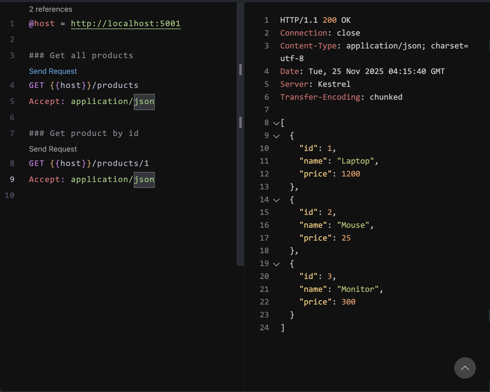
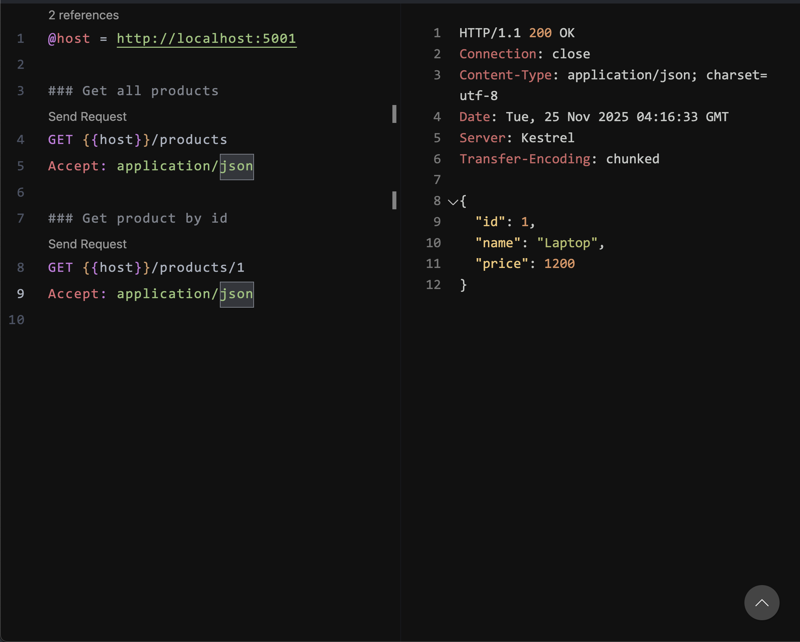
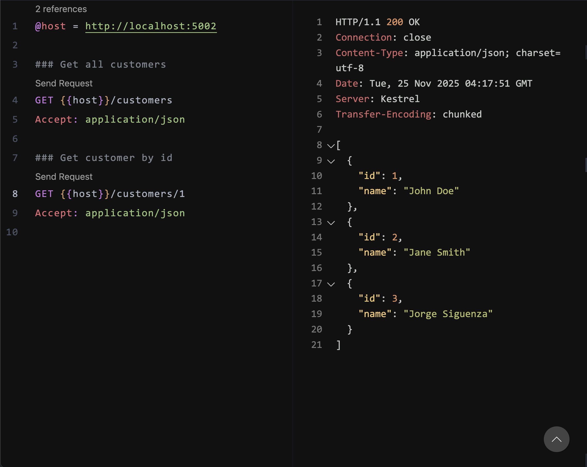
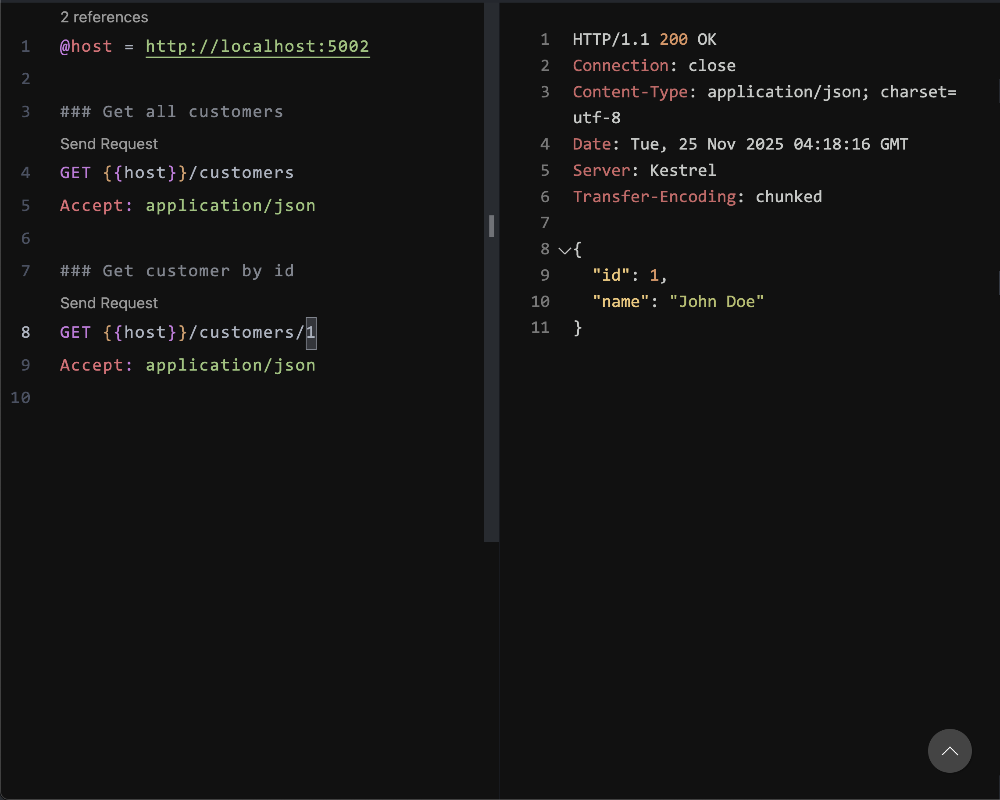
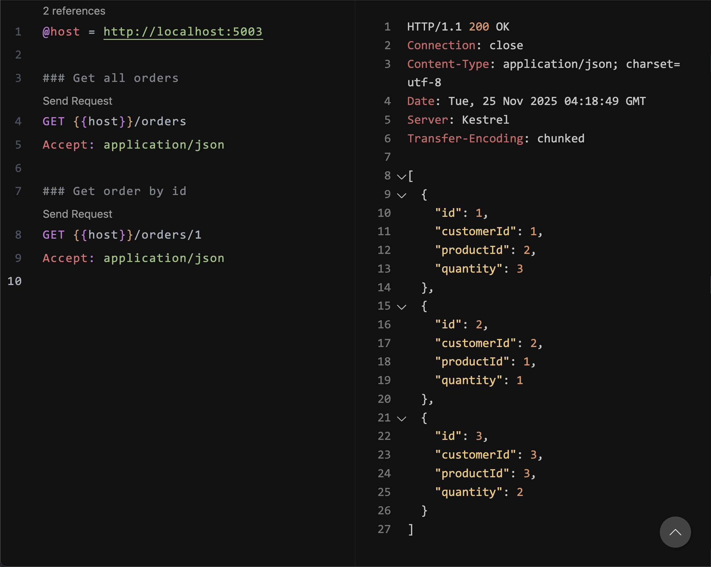
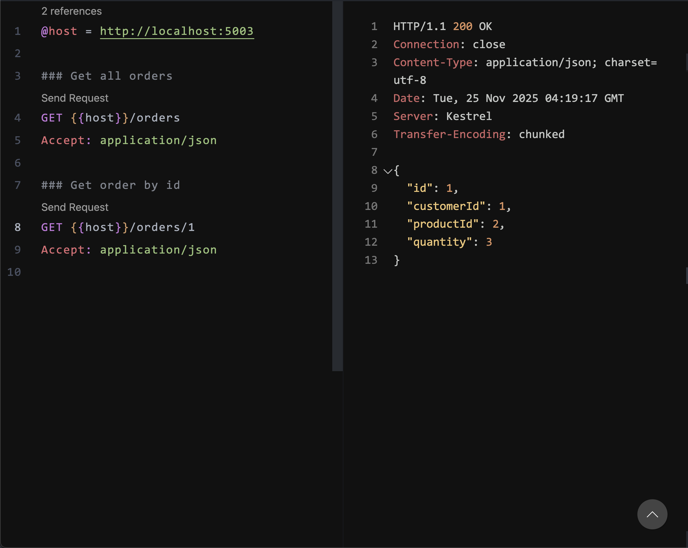
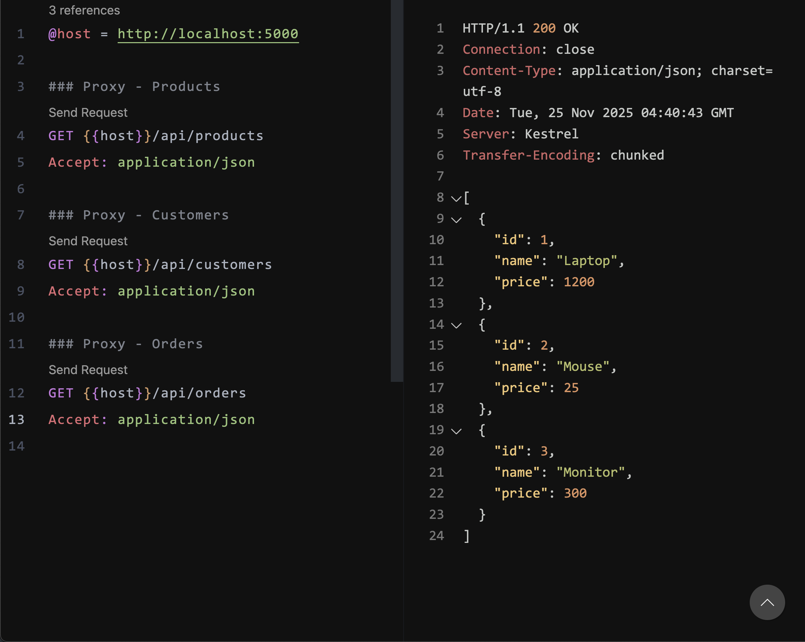
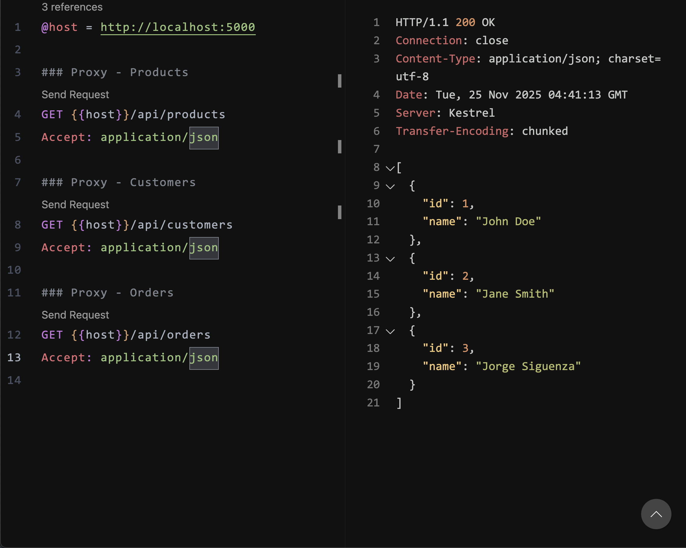
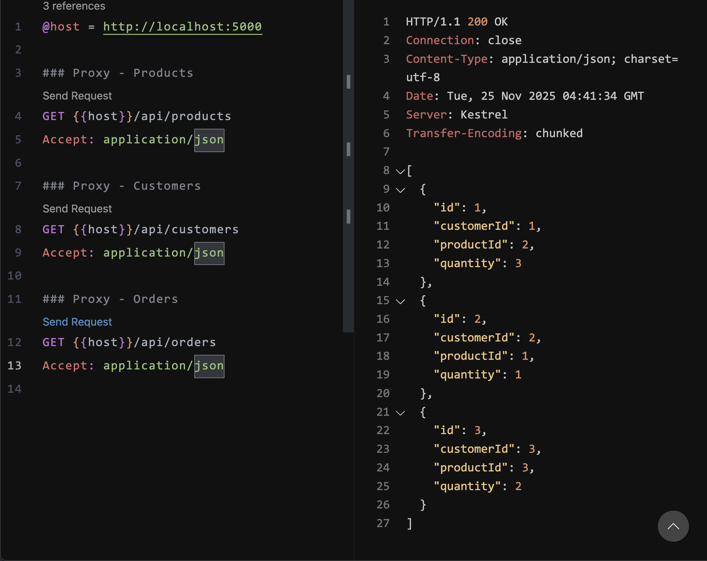

# Tarea Semana 6

Este proyecto implementa una arquitectura de **microservicios en .NET 8**, junto
con un **API Gateway utilizando YARP**, que actúa como punto de entrada
unificado para tres servicios independientes:

- **ProductService**
- **CustomerService**
- **OrderService**
- **Gateway (YARP Reverse Proxy)**

Cada microservicio corre en su propio contenedor Docker y expone rutas
independientes. El Gateway las unifica bajo un solo dominio mediante rutas:

- `/api/products`
- `/api/customers`
- `/api/orders`

## Arquitectura del Proyecto

Cada servicio corre en el puerto interno **8080**, y Docker Compose los expone
así:

| Servicio        | URL Externa           |
| --------------- | --------------------- |
| ProductService  | http://localhost:5001 |
| CustomerService | http://localhost:5002 |
| OrderService    | http://localhost:5003 |
| Gateway         | http://localhost:5000 |

---

# Endpoints funcionando

A continuación se muestran las pruebas realizadas tanto **directamente en cada
microservicio**, como **a través del API Gateway**.

---

# 1. ProductService

### Obtener todos los productos

**GET /products**



### Obtener producto por ID

**GET /products/1**



---

# 2. CustomerService

### Obtener todos los clientes

**GET /customers**



### Obtener cliente por ID

**GET /customers/1**



---

# 3. OrderService

### Obtener todas las órdenes

**GET /orders**



### Obtener orden por ID

**GET /orders/1**



---

# 4. API Gateway (YARP)

El Gateway expone los endpoints unificados:

- **GET /api/products**
- **GET /api/customers**
- **GET /api/orders**

### Productos desde el gateway



### Clientes desde el gateway



### Órdenes desde el gateway



---

# Docker

Para ejecutar todo el sistema:

```sh
docker compose up --build
```

Esto levanta los 4 servicios y los deja listos para recibir tráfico.
